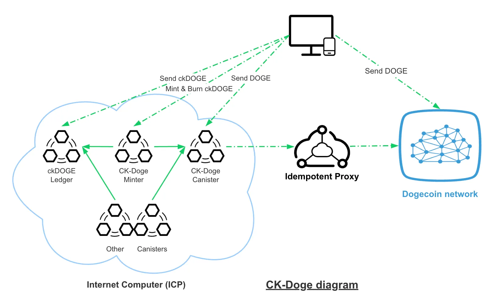
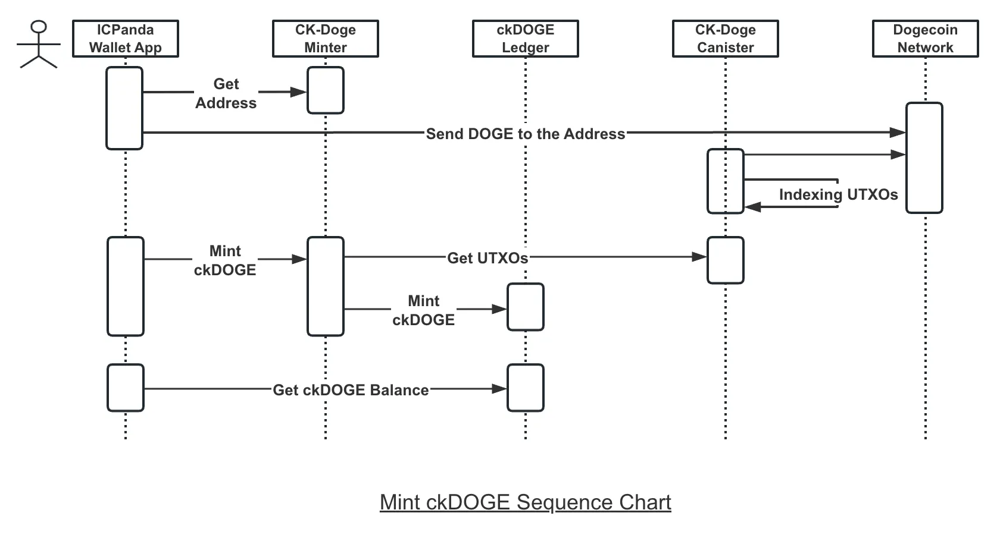
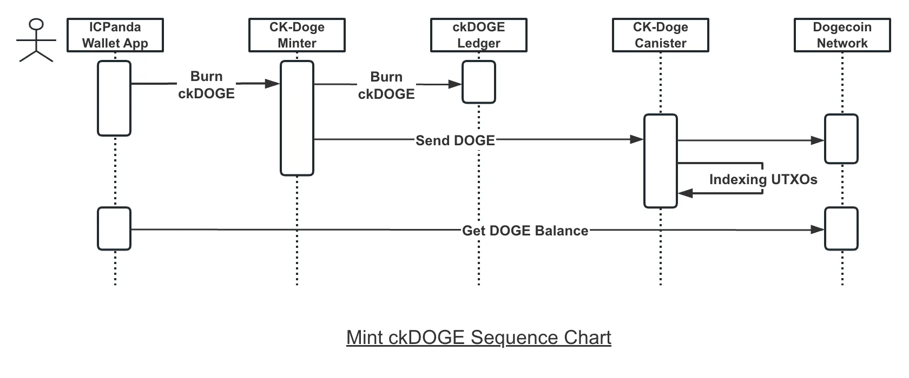

# CK-Doge
Chain-key Dogecoin (CK-Doge) offers on-chain integration with the Dogecoin network on [the Internet Computer (ICP)](https://internetcomputer.org/).

`ckDOGE` is an ICRC-2-compliant token, supported by the CK-Doge canisters, and is backed 1:1 by DOGE.

## Packages

| Package                                                                               |                                                 Crates.io                                                 |                                       Documentation                                        |                               Description                                |
| ------------------------------------------------------------------------------------- | :-------------------------------------------------------------------------------------------------------: | :----------------------------------------------------------------------------------------: | :----------------------------------------------------------------------: |
| [ck-doge-types](https://github.com/ldclabs/ck-doge/tree/main/src/ck-doge-types)       |  |  | General purpose rust library for using and interoperating with Dogecoin. |
| [CK-Doge Canister](https://github.com/ldclabs/ck-doge/tree/main/src/ck-doge-canister) |                                                     -                                                     |                                             -                                              |        Interact with Dogecoin network from the Internet Computer.        |
| [CK-Doge Minter](https://github.com/ldclabs/ck-doge/tree/main/src/ck-doge-minter)     |                                                     -                                                     |                                             -                                              |       Mint and burn `ckDOGE` <-> `DOGE` on the Internet Computer.        |

## Overview

CK-Doge offers on-chain integration with the Dogecoin network on the [Internet Computer](https://internetcomputer.org/).

CK-Doge leverages the technical design of Bitcoin Integration on the ICP, bringing Dogecoin from first-generation blockchain to third-generation blockchain in a streamlined and cost-effective manner.

A canister smart contract, the CK-Doge Canister, can operates effectively as an on-chain “Dogecoin light node”, receiving, holding, and indexing the complete set of [unspent transaction outputs (UTXOs)](https://en.wikipedia.org/wiki/Unspent_transaction_output) in an efficiently queryable form.
This CK-Doge Canister offers API on ICP the ability to submit signed transactions to the Dogecoin network. Submitted Dogecoin transactions are signed using [chain-key ECDSA (ckECDSA) signatures](https://internetcomputer.org/docs/current/developer-docs/integrations/t-ecdsa), an enhanced version of threshold ECDSA available only on the Internet Computer.

ckECDSA combined with the CK-Doge offers canister smart contracts running on ICP the ability to custody and transact native Dogecoin without the need for any additional third-party off-chain custodial or bridging solutions.

ckDOGE is a pair of ICP smart contracts building on the CK-Doge canisters and ckECDSA services. The contracts work together to enable users and canister smart contracts on ICP to send and receive DOGE value within seconds — far faster than is possible with native DOGE chain transactions, while also always allowing users and smart contracts to send and receive value to and from native DOGE network addresses.

ckDOGE exposes ICRC-1 and ICRC-2 ledger interfaces (the fungible token standards of ICP), making it simple for all wallets on the Internet Computer to offer ckDOGE support. Many wallets also support the additional inter-network transfers to and from DOGE addresses.

The CK-Doge Minter and [ckDOGE Ledger (ICRC-1 Ledger)](https://github.com/dfinity/ic/blob/master/rs/rosetta-api/icrc1/README.md) work in concert to ensure that the total value of ckDOGE cannot exceed the DOGE held by the two contracts.

## How it works

The ckDOGE functionality is provided through an interplay of three canisters:

- The CK-Doge canister: responsible for interacting with the Dogecoin network and indexing UTXOs.
- The CK-Doge minter: responsible for minting and burning ckDOGE tokens.
- The ckDOGE ledger: responsible for keeping account balances and for transferring ckDOGE between accounts.

### Mint ckDOGE workflow

1. A user get the Dogecoin address from the CK-Doge minter.
2. User sends DOGE to the Dogecoin address.
3. User calls the CK-Doge minter to mint ckDOGE tokens. The transaction should has 42 confirmations before minting.
4. The CK-Doge minter occupy the UTXOs and mints ckDOGE tokens on the ledger to the user.

### Burn ckDOGE workflow

1. A user calls the CK-Doge minter to burn ckDOGE tokens.
2. The CK-Doge minter burns the ckDOGE tokens on the ledger and spend the UTXOs, send the DOGE to the user.

## Reference
- [Chain Fusion (Chain-key)](https://internetcomputer.org/docs/current/developer-docs/multi-chain/overview)
- [Bitcoin Integration on the ICP](https://internetcomputer.org/docs/current/developer-docs/multi-chain/bitcoin/overview)
- [ckBTC Overview](https://internetcomputer.org/docs/current/developer-docs/multi-chain/chain-key-tokens/ckbtc/overview)
- [Idempotent Proxy](https://github.com/ldclabs/idempotent-proxy)
- [Dogecoin Home](https://dogecoin.com/)

## License
Copyright © 2024 [LDC Labs](https://github.com/ldclabs).

`ldclabs/ck-doge` is licensed under the MIT License. See [LICENSE](LICENSE-MIT) for the full license text.